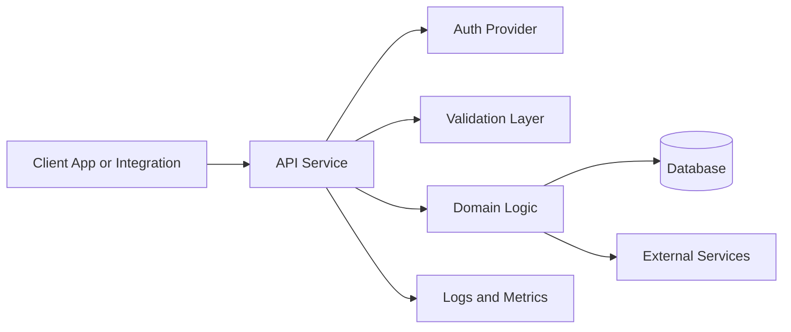

# Blueprint — API Service

## Purpose

Create an API-first service that exposes business capabilities to web apps, serverless workflows, integrations, or third-party clients.

---

## Typical features

- REST or GraphQL endpoints
- Authentication
- Authorization
- Database access
- External integrations
- Webhook handling
- OpenAPI documentation
- Logging and monitoring

---

## Recommended architecture



---

## REST API standards

- Use resource-oriented URLs.
- Use standard HTTP verbs.
- Validate all request input.
- Return consistent error responses.
- Use pagination for list endpoints.
- Use idempotency keys for operations that might be retried.
- Keep provider-specific details out of public errors.
- Document the API with OpenAPI when practical.

---

## Error response format

```json
{
  "ok": false,
  "error": {
    "code": "VALIDATION_ERROR",
    "message": "The request is invalid.",
    "details": {}
  }
}
```

---

## Architect intake questions

1. Who or what consumes the API?
2. Is this internal, external, or mixed?
3. What resources are exposed?
4. What operations are required?
5. What authentication is required?
6. What authorization rules apply?
7. What data store is used?
8. What integrations are required?
9. What rate limits or quotas are required?
10. What observability is required?

---

## Required artifacts

- API_SPEC.md
- ARCHITECTURE.md
- SECURITY.md
- TEST_PLAN.md
- RUNBOOK.md
- OpenAPI spec when useful

---

## Acceptance criteria

- Endpoints match the API contract.
- Request validation exists.
- Authentication and authorization are enforced.
- Errors are consistent and safe.
- Logs include request correlation IDs.
- Tests cover success, validation failure, auth failure, and provider failure paths.
