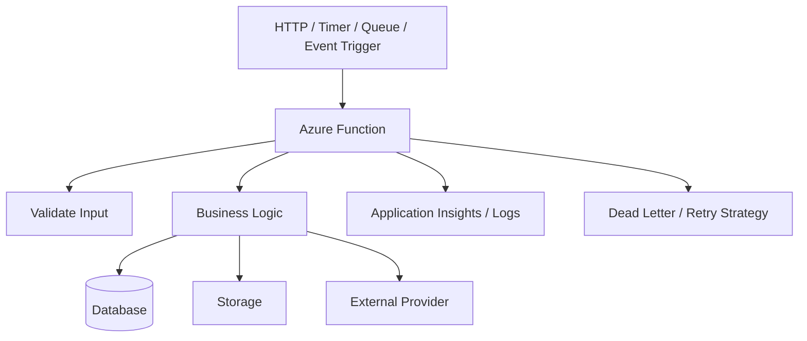

# Blueprint — Azure Functions

## Purpose

Create serverless workflows for APIs, scheduled jobs, queue processors, webhook handlers, and event-driven tasks.

---

## Typical uses

- Contact form submission
- Stripe webhook handler
- Plaid webhook handler
- Postmark inbound webhook
- Scheduled data sync
- Queue-based background processing
- File processing
- Notification jobs

---

## Recommended architecture

---

## Trigger types

| Trigger | Use when |
|---|---|
| HTTP | API endpoint or webhook |
| Timer | Scheduled job |
| Queue | Background processing |
| Blob | File upload processing |
| Event Grid | Event-driven cloud workflow |

---

## Architect intake questions

1. What triggers the function?
2. Is the function synchronous or asynchronous?
3. What inputs are expected?
4. What outputs or side effects occur?
5. Does the function need secrets?
6. Does it access a database or storage account?
7. Does it call third-party APIs?
8. What retry behavior is appropriate?
9. How should failures be logged or alerted?
10. Does the function need idempotency?

---

## Security rules

- Validate all inputs.
- Verify webhook signatures.
- Store secrets in configuration or Key Vault.
- Do not log secrets or sensitive payloads.
- Use managed identity where possible.
- Restrict CORS for HTTP functions.
- Apply least-privilege access to storage and databases.

---

## Reliability rules

- Use idempotency for webhook handlers and retried jobs.
- Design for duplicate events.
- Log correlation IDs.
- Use dead-letter queues for poison messages.
- Keep functions small and focused.
- Avoid long-running synchronous HTTP work.

---

## Acceptance criteria

- Function can run locally.
- Required configuration is documented.
- Trigger behavior is tested.
- Provider failure path is handled.
- Logs are useful for debugging.
- Idempotency is defined where needed.
- Deployment process is documented.
