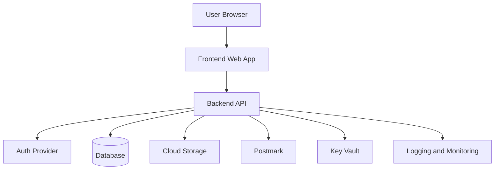

# Blueprint — Full-Stack Web App

## Purpose

Create a web application with frontend, backend/API, authentication, database, and operational requirements.

Use this blueprint when the product has users, accounts, dashboards, CRUD workflows, private data, or business rules that cannot safely live only on the client.

---

## Typical features

- Authentication
- User dashboard
- Role-based access
- CRUD workflows
- Database
- API layer
- Email notifications
- Admin tools
- Background jobs
- Observability

---

## Recommended architecture

---

## Suggested stack

| Layer | Suggested choice |
|---|---|
| Frontend | Next.js, React/Vite, Remix, or SvelteKit |
| Backend | Node.js API, .NET API, or Azure Functions |
| Database | Azure SQL, PostgreSQL, Cosmos DB, or Table Storage |
| Auth | Microsoft Entra ID, Auth0, Clerk, or app-specific auth |
| Secrets | Azure Key Vault |
| Email | Postmark |
| Hosting | Azure Static Web Apps, App Service, Container Apps, or Functions |
| Tests | Unit, integration, API, Playwright E2E |

---

## Architect intake questions

1. Who are the users?
2. What roles exist?
3. What business workflows are required?
4. What data must be stored?
5. What data is sensitive?
6. What authentication provider should be used?
7. What authorization rules apply?
8. What audit trail is needed?
9. What integrations are required?
10. What environments are required?

---

## Data design checklist

- Entities and relationships
- Ownership and tenancy rules
- Required fields
- Optional fields
- Indexes
- Unique constraints
- Soft delete or hard delete
- Audit fields
- Migrations
- Backup and retention

---

## API design checklist

- Resource model
- Endpoint naming
- Request validation
- Response shape
- Error format
- Auth requirements
- Rate limits
- Idempotency where needed
- Pagination and filtering
- Versioning strategy

---

## Acceptance criteria

- Users can authenticate.
- Authorization rules are enforced.
- CRUD workflows behave as specified.
- Sensitive data is protected.
- Database migrations are documented.
- API validation and error responses are consistent.
- Critical paths have automated tests.
- Runbook documents local setup and deployment.
