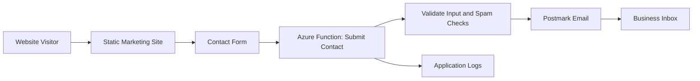

# Blueprint — Marketing Site

## Purpose

Create a public marketing website for a business, product, service, or campaign.

This is the recommended first AI App Factory project because it is small enough to complete quickly while still exercising the full delivery workflow: frontend, forms, serverless API, email, environment variables, testing, deployment, and release checklist.

---

## Typical features

- Home page
- About section or page
- Services/features section
- Contact form
- SEO metadata
- Open Graph/social metadata
- Analytics
- Postmark contact notifications
- Spam protection
- Static hosting
- Optional blog or CMS

---

## Recommended v1 scope

- Home page
- Services/features section
- Contact form
- Form validation
- Serverless form submission endpoint
- Postmark email notification
- Basic SEO metadata
- Basic accessibility checks
- `.env.example`
- README setup instructions
- Release checklist

---

## Explicit non-goals for v1

- CMS
- Authentication
- Database
- Payments
- Admin dashboard
- Complex animation
- Multi-language support

---

## Recommended architecture



---

## Suggested stack

| Layer | Suggested choice |
|---|---|
| Frontend | Astro, Next.js static export, React/Vite, or plain HTML/CSS |
| Hosting | Azure Static Web Apps |
| API | Azure Functions |
| Email | Postmark |
| Secrets | Azure Static Web Apps settings or Key Vault for larger projects |
| Tests | Vitest/Jest, Playwright, API tests |
| Monitoring | Azure Application Insights or platform logs |

---

## Architect intake questions

### Critical

1. What is the business or product being marketed?
2. What is the primary call to action?
3. What pages or sections are required for v1?
4. Who receives contact form submissions?
5. What fields are required on the contact form?
6. Should the form send only email, or also persist submissions?
7. Is there an existing logo, color palette, or brand voice?
8. What domain will be used?
9. Is SEO important for specific keywords or locations?
10. Is there a target launch date?

### Nice to have

1. Should analytics be included?
2. Should there be a blog?
3. Should there be testimonials, case studies, or portfolio items?
4. Should forms include spam protection?
5. Should contact submissions send an auto-reply to the visitor?

---

## Required environment variables

```bash
POSTMARK_SERVER_TOKEN=
POSTMARK_FROM_EMAIL=
CONTACT_TO_EMAIL=
CONTACT_REPLY_TO_EMAIL=
ALLOWED_ORIGIN=
```

Optional:

```bash
POSTMARK_MESSAGE_STREAM=
TURNSTILE_SECRET_KEY=
APPLICATIONINSIGHTS_CONNECTION_STRING=
```

---

## API endpoint

### `POST /api/contact`

Submits a contact form and sends an email.

#### Request body

```json
{
  "name": "Jane Doe",
  "email": "jane@example.com",
  "company": "Example Co",
  "message": "I would like to talk about a project."
}
```

#### Validation rules

- `name` is required.
- `email` is required and must be a valid email address.
- `message` is required.
- Message length should be capped.
- Unknown fields should be ignored or rejected consistently.
- Optional spam-protection token should be verified when enabled.

#### Success response

```json
{
  "ok": true,
  "data": {
    "message": "Thanks. Your message was sent."
  }
}
```

#### Error response

```json
{
  "ok": false,
  "error": {
    "code": "VALIDATION_ERROR",
    "message": "Please check the highlighted fields.",
    "details": {
      "fields": {
      "email": "Enter a valid email address."
      }
    }
  }
}
```

---

## Acceptance criteria

- Visitor can load the site on desktop and mobile.
- Contact form validates required fields.
- Invalid email addresses are rejected.
- Valid submission triggers a Postmark email.
- Secrets are not committed to source control.
- The form shows useful success and error states.
- The endpoint does not reveal secret or provider error details.
- Basic accessibility checks pass.
- Basic SEO metadata exists.
- Deployment instructions are documented.

---

## Test plan summary

### Unit tests

- Form validation logic
- API request validation
- Email payload creation

### Integration tests

- Contact endpoint with mocked Postmark client
- Error handling when Postmark fails

### E2E tests

- Visitor opens home page
- Visitor submits invalid form and sees validation
- Visitor submits valid form and sees success

### Security smoke tests

- No secrets in repo
- CORS behavior is restricted
- Input length limits are enforced
- Response does not leak provider errors

---

## Release checklist

- Domain configured
- Environment variables configured
- Contact form tested in production
- Postmark sender verified
- Emails delivered to intended inbox
- Logs checked after test submission
- Analytics verified if included
- Accessibility smoke check complete
- Rollback path known
