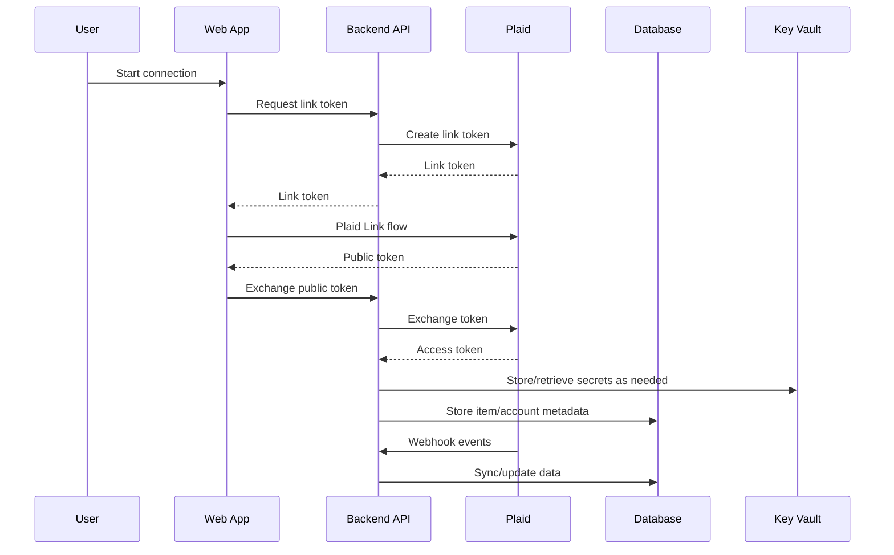

# Blueprint — Plaid Financial Data App

## Purpose

Create an application that uses Plaid Link to connect financial accounts and securely sync financial data.

---

## Delivery model

Like every factory project, this blueprint is delivered by the five-role agent team — Architect, Developer, Tester, Security, and Code Review — mapped to tools in the project's `.factory-roles.json`, with per-phase security and code-review gates and a six-party Gate D sign-off (the five roles plus the product owner). See `OPERATING_MODEL.md` and `docs/adr/0013-configurable-roles-and-tools.md`.

---

## Typical features

- Plaid Link frontend integration
- Link token creation
- Public token exchange
- Secure access token storage
- Account listing
- Transaction sync
- Webhook handling
- Background sync
- Audit logging

---

## Recommended architecture



---

## Security rules

- Do not expose Plaid secret to frontend code.
- Exchange public tokens only on the backend.
- Store access tokens securely.
- Minimize stored financial data.
- Encrypt sensitive data.
- Log operational metadata, not sensitive account details.
- Use environment-specific Plaid credentials.
- Handle item errors and reconnection flows.

---

## Architect intake questions

1. What Plaid products are required?
2. What financial institutions or account types matter?
3. What data must be stored locally?
4. What data should not be stored locally?
5. How often should data sync?
6. What webhooks must be handled?
7. What user consent screens or disclosures are required?
8. What happens when an item requires reauthentication?
9. What data retention policy applies?
10. What reporting or export features are required?

---

## Suggested database entities

> **Database default:** PostgreSQL (Flexible Server), then Azure SQL, then Cosmos DB. See `docs/adr/0007-default-database-postgres-then-sql-then-cosmos.md` for the decision and trade-offs.

### PlaidItem

- id
- user_id
- plaid_item_id
- institution_id
- institution_name
- access_token_reference
- status
- created_at
- updated_at

### Account

- id
- plaid_item_id
- plaid_account_id
- name
- official_name
- type
- subtype
- mask
- created_at
- updated_at

### Transaction

- id
- account_id
- plaid_transaction_id
- date
- name
- amount
- currency
- pending
- category
- created_at
- updated_at

### WebhookEvent

- id
- provider_event_id
- webhook_type
- webhook_code
- received_at
- processed_at
- processing_status

---

## Required environment variables

```bash
PLAID_CLIENT_ID=
PLAID_SECRET=
PLAID_ENV=
PLAID_PRODUCTS=
PLAID_COUNTRY_CODES=
APP_BASE_URL=
```

---

## Acceptance criteria

- Backend creates Plaid Link token.
- Frontend can initialize Link.
- Backend exchanges public token.
- Access token is not exposed to frontend.
- Account metadata is stored.
- Transactions can be synced when enabled.
- Webhooks are handled safely.
- Reauth/error states are documented.

---

## Worked example

For a complete walkthrough of this blueprint applied to a personal-finance dashboard, see `examples/sample-plaid-architecture.md` along with the matching project brief, test plan, and developer/QE handoffs.
