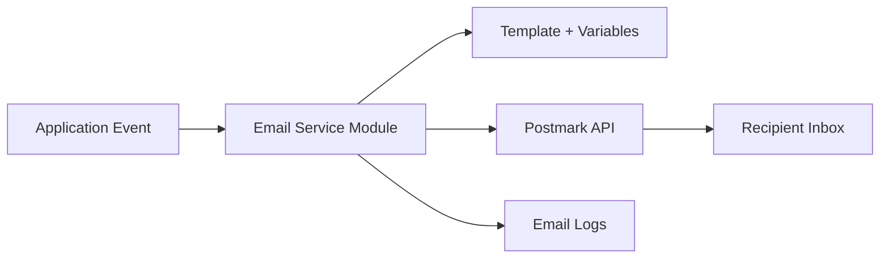

# Blueprint — Postmark Email

## Purpose

Create transactional email workflows using Postmark for contact forms, notifications, receipts, onboarding messages, or operational alerts.

---

## Common email types

- Contact form notification
- Visitor auto-reply
- Welcome email
- Password reset
- Payment receipt notification
- Subscription status notification
- Internal operational alert
- Admin notification

---

## Recommended architecture



---

## Email workflow definition

Every email should have:

- Name
- Purpose
- Trigger
- Recipient
- Sender
- Reply-to behavior
- Template or body source
- Variables
- Retry behavior
- Logging behavior
- Failure handling
- Unsubscribe requirements if applicable

---

## Architect intake questions

1. What event triggers the email?
2. Who receives it?
3. Is the email transactional or marketing?
4. Should a Postmark template be used?
5. What variables are required?
6. What sender domain should be used?
7. What reply-to address should be used?
8. Should failures be retried?
9. Should failures alert an operator?
10. Should delivery status be stored?

---

## Required environment variables

```bash
POSTMARK_SERVER_TOKEN=
POSTMARK_FROM_EMAIL=
POSTMARK_MESSAGE_STREAM=
```

Optional:

```bash
POSTMARK_TEMPLATE_ALIAS=
POSTMARK_REPLY_TO_EMAIL=
EMAIL_FAILURE_ALERT_TO=
```

---

## Suggested email service interface

```ts
type SendEmailInput = {
  to: string;
  from?: string;
  replyTo?: string;
  subject: string;
  textBody?: string;
  htmlBody?: string;
  templateAlias?: string;
  templateModel?: Record<string, unknown>;
  messageStream?: string;
};

type SendEmailResult = {
  provider: "postmark";
  messageId?: string;
  submittedAt: string;
};
```

---

## Security and privacy rules

- Do not log email body when it contains sensitive content.
- Do not expose Postmark tokens to frontend code.
- Validate recipient addresses.
- Use templates for consistent formatting.
- Avoid sending secrets, tokens, or financial data in plain text unless required and safe.
- Keep marketing and transactional emails separate.
- Follow unsubscribe requirements for marketing email.

---

## Acceptance criteria

- Email workflow has a documented trigger.
- Sender and recipient are documented.
- Template variables are documented.
- Postmark token is stored securely.
- Success and failure paths are handled.
- Tests cover email payload creation.
- Provider errors are logged safely.
