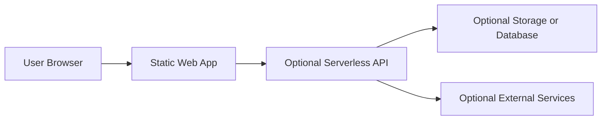

# Blueprint — Static Web App

## Purpose

Create a static or mostly-static web application that can be deployed cheaply, globally, and simply.

Static web apps are a good fit for public tools, dashboards with public data, calculators, forms, content-driven sites, and apps where most logic can live safely in the browser or serverless functions.

---

## Typical features

- Client-rendered UI
- Routes/pages
- Forms
- Search and filtering
- Public data
- Optional serverless API
- Optional cloud storage
- Optional authentication
- Static hosting and CDN

---

## Recommended architecture

---

## Suggested stack

| Layer | Suggested choice |
|---|---|
| Frontend | React/Vite, Astro, SvelteKit static, Next.js static export |
| Hosting | Azure Static Web Apps |
| API | Azure Functions when needed |
| Data | Static JSON, Blob Storage, Table Storage, Cosmos DB, or Azure SQL |
| Auth | Azure Static Web Apps auth, Microsoft Entra ID, Auth0, Clerk, or custom |
| Tests | Vitest/Jest, Playwright |

---

## Architect intake questions

1. Is the app fully public, private, or mixed?
2. Does the app need authentication?
3. What user journeys matter most?
4. What data is loaded by the app?
5. Is data static, user-generated, or pulled from an API?
6. Does the app need offline support?
7. What devices and browsers must be supported?
8. Are there accessibility requirements?
9. Are there performance targets?
10. What environments are required?

---

## Common design decisions

### Static data vs API data

Use static data when:

- Data rarely changes.
- Data can be public.
- Rebuilds are acceptable.

Use API-backed data when:

- Data changes frequently.
- Data is private.
- Users can create or modify data.
- External integrations are required.

### Client-only vs serverless backend

Use client-only when:

- There are no secrets.
- The data is public.
- The logic is not sensitive.

Use serverless backend when:

- Secrets are required.
- Email/payment/storage/database operations are required.
- Access control is required.
- Webhooks are required.

---

## Acceptance criteria

- Static app deploys successfully.
- App loads on supported browsers/devices.
- Critical routes work with direct navigation.
- Environment-specific settings are documented.
- No secrets are exposed in frontend code.
- Basic accessibility checks pass.
- Tests cover critical user journeys.
