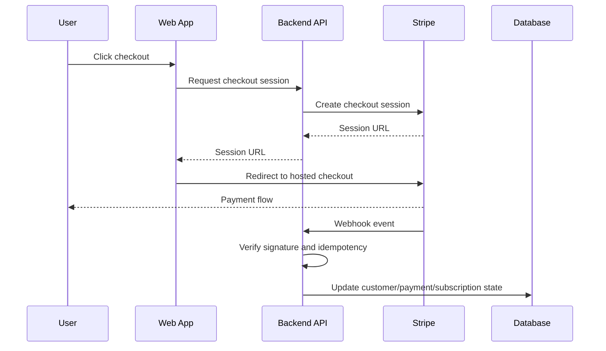

# Blueprint — Stripe Payment App

## Purpose

Create a web application or API flow that uses Stripe for checkout, one-time payments, subscriptions, invoices, customer portal, or payment webhooks.

---

## Delivery model

Like every factory project, this blueprint is delivered by the five-role agent team — Architect, Developer, Tester, Security, and Code Review — mapped to tools in the project's `.factory-roles.json`, with per-phase security and code-review gates and a six-party Gate D sign-off (the five roles plus the product owner). See `OPERATING_MODEL.md` and `docs/adr/0013-configurable-roles-and-tools.md`.

---

## Common payment flows

- One-time checkout
- Subscription checkout
- Customer portal
- Payment success handling
- Failed payment handling
- Subscription lifecycle handling
- Entitlement activation/deactivation
- Refund or cancellation workflows

---

## Recommended architecture



---

## Security rules

- Prefer Stripe-hosted checkout for v1.
- Do not store card data locally.
- Verify webhook signatures.
- Treat webhooks as the source of truth for payment state.
- Make webhook processing idempotent.
- Store only the minimum Stripe IDs and status fields needed.
- Do not expose secret keys to frontend code.
- Use environment-specific Stripe keys.

---

## Architect intake questions

1. Is the flow one-time payment, subscription, invoice, or marketplace?
2. What products, prices, or plans exist?
3. Who receives access after payment?
4. What happens after successful payment?
5. What happens after failed payment?
6. Is there a customer portal?
7. What webhook events must be handled?
8. What customer/payment/subscription records are stored locally?
9. What business entitlements are tied to payment status?
10. What refund/cancellation rules apply?

---

## Suggested database entities

> **Database default:** PostgreSQL (Flexible Server), then Azure SQL, then Cosmos DB. See `docs/adr/0007-default-database-postgres-then-sql-then-cosmos.md` for the decision and trade-offs.

### Customer

- id
- user_id
- stripe_customer_id
- email
- created_at
- updated_at

### Payment or Subscription

- id
- customer_id
- stripe_checkout_session_id
- stripe_payment_intent_id
- stripe_subscription_id
- status
- amount
- currency
- created_at
- updated_at

### WebhookEvent

- id
- stripe_event_id
- type
- processed_at
- processing_status
- error_message

---

## Required environment variables

```bash
STRIPE_SECRET_KEY=
STRIPE_WEBHOOK_SECRET=
STRIPE_PRICE_ID=
APP_BASE_URL=
```

---

## Acceptance criteria

- Checkout session can be created.
- Frontend redirects to Stripe-hosted checkout.
- Webhook endpoint verifies Stripe signature.
- Duplicate webhook events are safely ignored.
- Payment/subscription state is updated from webhooks.
- Failed payments are handled.
- Secrets are not exposed.
- Tests cover checkout creation and webhook handling.

---

## Worked example

For a complete walkthrough of this blueprint applied to a subscription SaaS, see `examples/sample-stripe-architecture.md` along with the matching project brief, test plan, and developer/QE handoffs.

For the threat model of this blueprint applied to a subscription SaaS, see `examples/sample-stripe-threat-model.md`.
