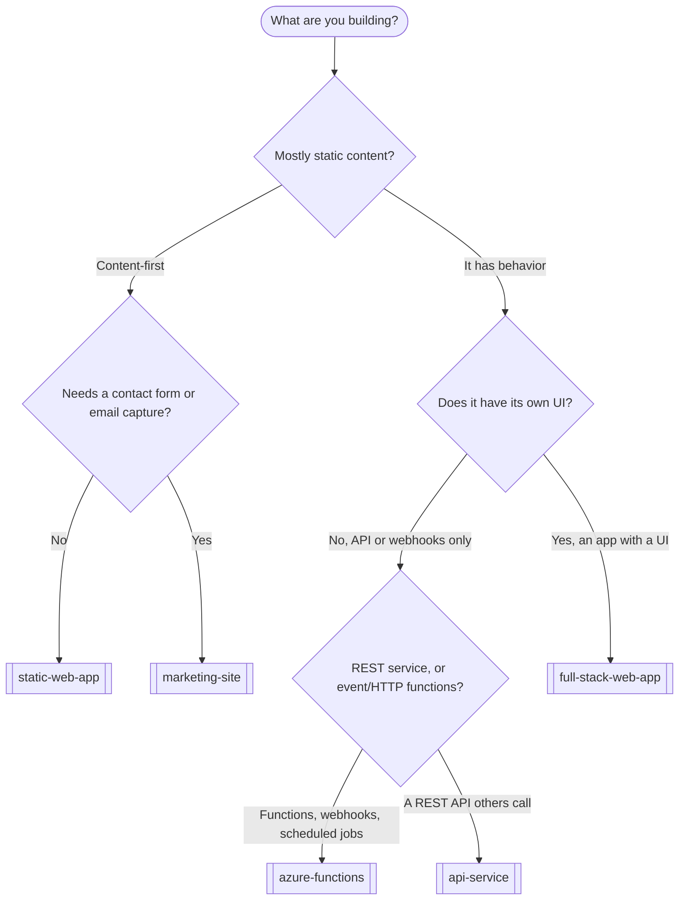

# Choosing a blueprint

> A map to converge on the right factory blueprint — and the right complexity — before `/intake` and `/design`. Start at the simplest shape that satisfies v1; add capability overlays only when v1 needs them. The factory targets greenfield projects (`docs/adr/0005-greenfield-only-scope.md`) on Azure + TypeScript by default (`docs/adr/0001-default-cloud-azure.md`, `docs/adr/0003-default-language-typescript.md`).

## How to use this

1. Walk the decision tree to a **base shape** (one blueprint).
2. Check the **capability overlays** — payments, financial data, email — and add the matching integration blueprint(s).
3. Pick the **lowest complexity tier** that covers your v1 scope.
4. Take that into `/intake`; the critical questions there confirm or correct the choice.

A blueprint is a starting point, not a cage. Any default can be overridden — but the override is an ADR, not a silent drift.

## Base-shape decision tree

## The eight blueprints

| Blueprint | What it is | Default stack | Pick it when | Not when |
|---|---|---|---|---|
| `blueprints/static-web-app.md` | Static content, no backend | Astro, Azure Static Web Apps | Pure content, docs, brochure | You need a form, auth, or data |
| `blueprints/marketing-site.md` | Static site + contact form + email | Astro + Azure Functions + Postmark | Marketing site that captures leads | You need accounts or a dashboard |
| `blueprints/full-stack-web-app.md` | App with UI, auth, and data | Next.js, Azure SQL/Postgres, Entra ID | Users sign in and work with data | A backend with no UI |
| `blueprints/api-service.md` | REST API others consume | Azure Functions or Node, OpenAPI | A documented API is the product | The product is a UI |
| `blueprints/azure-functions.md` | Serverless functions, webhooks, jobs | Azure Functions (TypeScript) | Event-driven or webhook processing | A long-lived stateful service |
| `blueprints/stripe-app.md` | Payments overlay | Stripe Checkout + webhooks | Money changes hands | No payments in v1 |
| `blueprints/plaid-app.md` | Financial-account overlay | Plaid Link + token exchange | You connect bank or financial accounts | No financial data |
| `blueprints/postmark-email.md` | Transactional email overlay | Postmark | You send receipts, alerts, login mail | No outbound email |

## Capability overlays

The last three blueprints are **overlays** — you compose them onto a base shape, you do not pick them instead of one.

| If v1 must... | Add | Brings | Maps to intake question |
|---|---|---|---|
| Take payments or run subscriptions | `blueprints/stripe-app.md` | Stripe Checkout, webhook idempotency, entitlement records | Mandatory integrations (Q7) |
| Connect a user's bank or financial accounts | `blueprints/plaid-app.md` | Plaid Link, secure token storage in Key Vault | Data classification (Q6), integrations (Q7) |
| Send transactional email | `blueprints/postmark-email.md` | Postmark templates, signature and idempotency on webhooks | Integrations (Q7) |

Any overlay that handles money, financial, health, or personal data raises the data-classification answer in `/intake` (question 6) and usually warrants a threat model (`templates/THREAT_MODEL.md`).

## Complexity tiers — start small, add only for v1

Pick the lowest tier your v1 actually needs. Moving up a tier is a deliberate scope decision, recorded in `PROJECT.md`.

- **Content** — `blueprints/static-web-app.md` (tier 1: pure content) then `blueprints/marketing-site.md` (tier 2: + contact form + Postmark + SEO).
- **App with a UI** — `blueprints/full-stack-web-app.md`: tier 1 read-only views, tier 2 authenticated CRUD, tier 3 plus a `blueprints/stripe-app.md` or `blueprints/plaid-app.md` overlay.
- **Backend only** — `blueprints/azure-functions.md` (tier 1: a webhook or scheduled job) then `blueprints/api-service.md` (tier 2: a documented REST API with a datastore and auth).

If your "one app" is really several shapes side by side (a marketing site *and* a signed-in app *and* a payments backend), that is normal — scope each as its own slice set in `TASKS.md`, sharing one architecture.

## Cross-cutting axes (decide these early)

Each axis has a factory default; overriding it is an ADR.

| Axis | Factory default | Where it lands |
|---|---|---|
| Cloud | Azure (`docs/adr/0001-default-cloud-azure.md`) | `ARCHITECTURE.md`, `templates/infra/main.bicep` |
| Language | TypeScript (`docs/adr/0003-default-language-typescript.md`) | `standards/coding-standards.md` |
| Infrastructure as code | Bicep (`docs/adr/0004-default-iac-bicep.md`) | `templates/infra/` |
| Datastore | Postgres, then Azure SQL, then Cosmos (`docs/adr/0007-default-database-postgres-then-sql-then-cosmos.md`) | `ARCHITECTURE.md` |
| Secrets | Key Vault in cloud; `.env` locally | `SECURITY.md`, `templates/.env.example` |
| Email | Postmark (`docs/adr/0002-default-email-postmark.md`) | `blueprints/postmark-email.md` |
| Auth | Provider-hosted (Entra ID or managed) before custom | `SECURITY.md` |
| Payments | Stripe-hosted before custom | `blueprints/stripe-app.md` |

## Next step

Run `/intake`. Bring the base shape, the overlays, and the tier you landed on; intake's critical questions will confirm the fit or surface a reason to move.
