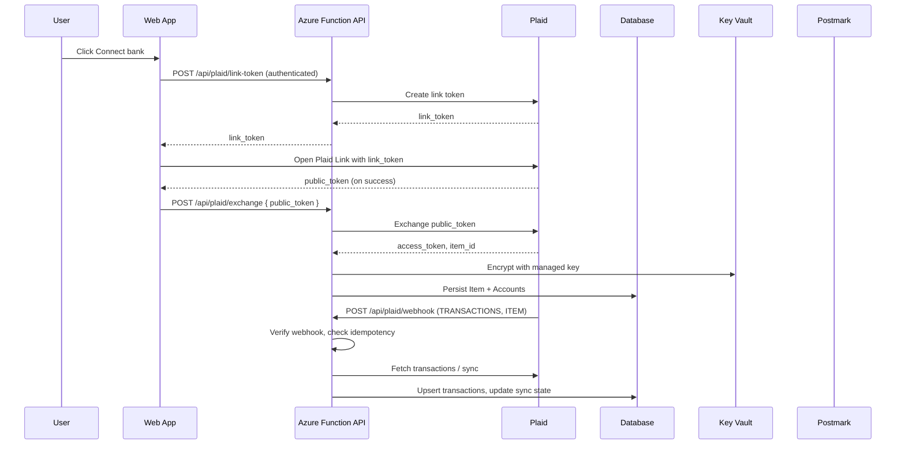

# Sample Architecture — Personal Finance Dashboard with Plaid

## Executive summary

A small full-stack app hosted on Azure. The frontend is a React or Next.js app served by Azure Static Web Apps; it embeds Plaid Link in the browser. Backend Azure Functions create link tokens, exchange public tokens, persist Item / Account / Transaction metadata, handle Plaid webhooks, and send Postmark summaries. Plaid is the source of truth for financial data; the local database is a thin cache plus a small audit log.

Access tokens are stored encrypted using a Key Vault-managed key. The frontend never sees an access token, secret, or institution credential.

---

## Recommended architecture



---

## Components

| Component | Responsibility | Technology |
|---|---|---|
| Web frontend | Dashboard, Plaid Link container, reconnect prompts | React + Vite or Next.js on Azure Static Web Apps |
| Auth | Identify the account holder | Microsoft Entra ID, Auth0, or Clerk (decided by ADR) |
| Link-token API | Mint Plaid link tokens for the current user | Azure Function (TypeScript) |
| Exchange API | Exchange public tokens server-side, persist Item | Azure Function (TypeScript) |
| Webhook API | Receive Plaid events, sync transactions, flag reauth | Azure Function (TypeScript) |
| Sync worker | Schedule periodic sync as a backstop to webhooks | Timer-triggered Azure Function |
| Database | Item / Account / Transaction state + webhook idempotency log | Azure SQL or managed PostgreSQL |
| Secret store | Plaid credentials + KMS-style key for access-token encryption | Azure Key Vault |
| Email | Weekly summaries and reconnect nudges | Postmark |
| Observability | Logs, traces, alerts | Application Insights |

---

## API design

### `POST /api/plaid/link-token`

Authenticated. Returns a Plaid `link_token` scoped to the current user.

#### Success

```json
{ "ok": true, "data": { "link_token": "link-..." } }
```

### `POST /api/plaid/exchange`

Authenticated. Exchanges a `public_token` for an `access_token`, persists the Item and Accounts, returns a small client-safe summary.

#### Request

```json
{ "public_token": "public-..." }
```

#### Success

```json
{
  "ok": true,
  "data": {
    "item_id": "item_...",
    "institution_name": "First Platypus Bank",
    "accounts": [
      { "account_id": "acc_...", "name": "Checking", "mask": "1234" }
    ]
  }
}
```

### `POST /api/plaid/webhook`

Public endpoint. Receives Plaid webhook events. The handler verifies the request via Plaid's recommended JWT verification, looks up the affected Item, and dispatches based on `webhook_type` + `webhook_code`.

Handled events in v1:

- `TRANSACTIONS / SYNC_UPDATES_AVAILABLE` — pull deltas via `/transactions/sync` and upsert.
- `TRANSACTIONS / INITIAL_UPDATE` and `HISTORICAL_UPDATE` — same handler, larger windows.
- `ITEM / ERROR` with `ITEM_LOGIN_REQUIRED` — mark Item `requires_reauth=true`, email the user.
- `ITEM / PENDING_EXPIRATION` — email the user.
- `ITEM / USER_PERMISSION_REVOKED` — mark Item revoked, hide from dashboard.

---

## Data model

| Entity | Purpose | Key fields |
|---|---|---|
| `PlaidItem` | One bank connection per user per institution | `id`, `user_id`, `plaid_item_id` (unique), `institution_id`, `institution_name`, `access_token_ref` (Key Vault secret name), `cursor`, `status` (`active` / `requires_reauth` / `revoked`), `last_sync_at` |
| `Account` | Individual checking/savings/credit accounts | `id`, `plaid_item_id`, `plaid_account_id` (unique), `name`, `official_name`, `mask`, `type`, `subtype` |
| `Transaction` | Recent transactions; older rows pruned per retention policy | `id`, `account_id`, `plaid_transaction_id` (unique), `date`, `name`, `amount`, `currency`, `pending`, `category` |
| `WebhookEvent` | Idempotency log for Plaid webhooks | `provider_event_id` (unique), `webhook_type`, `webhook_code`, `received_at`, `processed_at`, `processing_status` |

The raw access token is never stored in the database. Only the Key Vault secret name (`access_token_ref`) is stored; the actual token is fetched at sync time via managed identity.

---

## Integrations

| Integration | Purpose | Auth/secret | Failure behavior |
|---|---|---|---|
| Plaid Link | Frontend account connection | `link_token` (short-lived, minted server-side) | Show user-safe error, log Plaid error code |
| Plaid Items | Token exchange and management | `PLAID_CLIENT_ID` + `PLAID_SECRET` | Retry transient errors with backoff; surface terminal errors |
| Plaid Transactions | Recent transactions sync | Same | Idempotent; resume from stored `cursor` on retry |
| Plaid Webhooks | Event-driven sync triggers | JWT verification key from Plaid | Reject invalid signatures; idempotency log de-duplicates |
| Postmark | Weekly summary + reauth nudges | `POSTMARK_SERVER_TOKEN` | Log failure, do not block webhook 200 response |
| Key Vault | Encrypt access tokens at rest | Managed identity | Block exchange if Key Vault unavailable |

---

## Security model

- Plaid `PLAID_SECRET` and all access tokens are backend-only. They never appear in frontend bundles or client-visible API responses.
- Access tokens are stored encrypted at rest using a Key Vault-managed key. The DB only holds a reference, not the token itself.
- Every webhook is verified using Plaid's recommended JWT-with-public-key flow before any business logic runs.
- The webhook handler uses the `WebhookEvent` table as an idempotency log keyed on Plaid's `webhook` request id; handler logic only runs on first insert.
- Authentication is required on `/api/plaid/link-token` and `/api/plaid/exchange`. The webhook endpoint is unauthenticated by Plaid's design, which is why JWT verification is mandatory.
- The dashboard reads only the current user's Items, Accounts, and Transactions. Every query is scoped to `user_id`.
- Sensitive transaction details (names, amounts) are excluded from logs. Logs include only `item_id`, `account_id`, `webhook_type`, and `webhook_code`.
- The frontend is served with `Content-Security-Policy` allowing `cdn.plaid.com` and otherwise restricted to first-party origins.

---

## Environment and deployment plan

| Environment | Purpose | Plaid env |
|---|---|---|
| Local | Developer testing | `PLAID_ENV=sandbox` |
| Dev | Shared testing | `PLAID_ENV=sandbox` |
| Staging | Release candidate | `PLAID_ENV=development` |
| Production | Live system | `PLAID_ENV=production` |

CI/CD via GitHub Actions: lint, type-check, unit tests, integration tests against the Plaid sandbox, build, deploy.

---

## Trade-offs

| Decision | Benefit | Cost/risk |
|---|---|---|
| Plaid Transactions Sync (cursor-based) vs Transactions Get (date-range) | Idempotent, naturally resumable on failure | Slightly more complex cursor bookkeeping |
| Store only Plaid IDs and minimal metadata locally | Reduces blast radius if DB is breached | More API calls to Plaid; cache invalidation work |
| Encrypt access tokens via Key Vault key, store reference in DB | DB compromise alone does not expose tokens | Adds a Key Vault round-trip per sync |
| Timer-triggered sync as a backstop to webhooks | Webhooks can be delayed; backstop bounds staleness | Slight extra cost; concurrency control needed |
| Sandbox in v1, development tier later | Free, fast iteration | No real bank data until graduation |

---

## Risks and mitigations

| Risk | Mitigation |
|---|---|
| Lost webhook delivery causes stale data | Timer-triggered sync every 6 hours as a backstop |
| Concurrent sync (timer + webhook) duplicates transactions | Unique constraint on `plaid_transaction_id` + advisory lock per Item during sync |
| `ITEM_LOGIN_REQUIRED` is missed by the user | Email nudge on first webhook + visible dashboard banner |
| Access token leakage via logs | Disallow at log layer; review logs in QE pass |
| Plaid sandbox vs production behavior differences | Staging environment uses development tier before production cutover |
| Key Vault outage blocks every sync | Cache last-known summary so the dashboard degrades gracefully (read-only view) |

---

## Work breakdown

1. Auth bootstrap and protected dashboard route.
2. `PlaidItem`, `Account`, `Transaction`, `WebhookEvent` tables and migrations.
3. `POST /api/plaid/link-token` with auth and validation.
4. Plaid Link integration in the frontend.
5. `POST /api/plaid/exchange` with token exchange, Key Vault encryption, and Item persistence.
6. `POST /api/plaid/webhook` with JWT verification and idempotency log.
7. `TRANSACTIONS / SYNC_UPDATES_AVAILABLE` handler with cursor-based fetch.
8. `ITEM / ERROR` handlers + reconnect UI.
9. Timer-triggered sync backstop.
10. Postmark weekly summary job.
11. Tests for each of the above.
12. Staging dry run against Plaid development tier.
