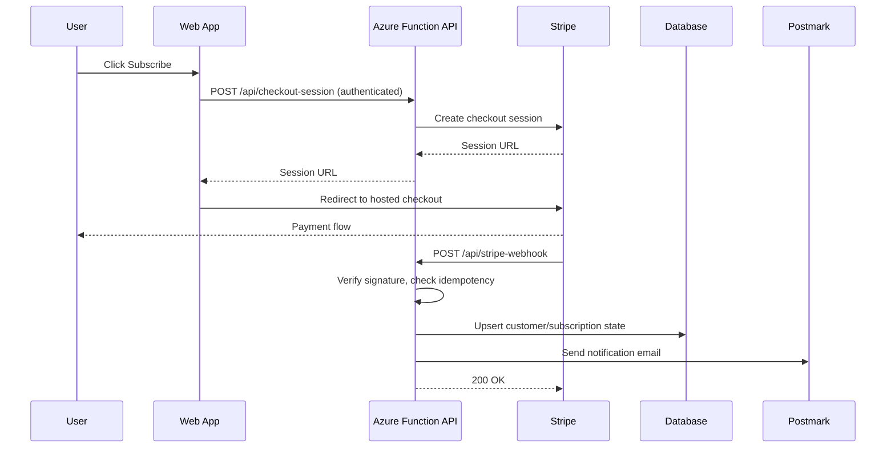

# Sample Architecture — Subscription SaaS with Stripe

## Executive summary

A small full-stack SaaS hosted on Azure. The frontend is a Next.js or React app served via Azure Static Web Apps. The backend is a small set of Azure Functions for authenticated API calls, Stripe Checkout session creation, Customer Portal session creation, and the Stripe webhook receiver. Subscription state is mirrored in Azure SQL (or PostgreSQL via a managed provider). Postmark sends transactional emails on subscription state changes.

Stripe is the source of truth for billing. The local database stores the minimum identifiers (`stripe_customer_id`, `stripe_subscription_id`, `status`) needed to gate dashboard access.

---

## Recommended architecture



---

## Components

| Component | Responsibility | Technology |
|---|---|---|
| Web frontend | Marketing page, signup, dashboard, links to Checkout and Portal | Next.js or React + Vite on Azure Static Web Apps |
| Auth | Authenticate users before any Stripe call | Microsoft Entra ID, Auth0, or Clerk (decided by ADR) |
| Checkout API | Create Stripe Checkout sessions on behalf of authenticated users | Azure Function (TypeScript) |
| Portal API | Create Stripe Customer Portal sessions for the current user | Azure Function (TypeScript) |
| Webhook API | Receive Stripe events, verify signature, persist state, fan out emails | Azure Function (TypeScript) |
| Database | Mirror minimal subscription state for gating | Azure SQL or managed PostgreSQL |
| Email | Transactional notifications | Postmark |
| Secrets | Stripe and Postmark tokens | Azure Key Vault (production) / app settings (dev) |
| Observability | Logs, traces, alerts | Application Insights |

---

## API design

### `POST /api/checkout-session`

Authenticated. Creates a Stripe Checkout session for the current user and returns the redirect URL.

#### Request

```json
{
  "priceId": "price_..."
}
```

#### Success

```json
{
  "ok": true,
  "data": {
    "url": "https://checkout.stripe.com/c/pay/..."
  }
}
```

### `POST /api/portal-session`

Authenticated. Creates a Stripe Customer Portal session for the current user.

#### Success

```json
{
  "ok": true,
  "data": {
    "url": "https://billing.stripe.com/p/session/..."
  }
}
```

### `POST /api/stripe-webhook`

Public endpoint. Receives Stripe events. Verifies the `Stripe-Signature` header against `STRIPE_WEBHOOK_SECRET`. Rejects invalid signatures with `400`. Processes events idempotently keyed on Stripe `event.id`.

Handled event types in v1:

- `checkout.session.completed`
- `customer.subscription.created`
- `customer.subscription.updated`
- `customer.subscription.deleted`
- `invoice.payment_failed`

---

## Data model

| Entity | Purpose | Key fields |
|---|---|---|
| `Customer` | Maps app user to Stripe customer | `id`, `user_id`, `stripe_customer_id`, `email`, `created_at`, `updated_at` |
| `Subscription` | Mirrors active subscription state | `id`, `customer_id`, `stripe_subscription_id`, `status`, `current_period_end`, `cancel_at_period_end`, `price_id` |
| `WebhookEvent` | Idempotency log for Stripe events | `stripe_event_id` (unique), `type`, `received_at`, `processed_at`, `processing_status`, `error_message` |

No payment-method or card data is stored locally. Stripe owns it.

---

## Integrations

| Integration | Purpose | Auth/secret | Failure behavior |
|---|---|---|---|
| Stripe Checkout | Hosted payment flow | `STRIPE_SECRET_KEY` | Return user-safe error, log Stripe error code, do not expose details |
| Stripe Webhook | Subscription state events | `STRIPE_WEBHOOK_SECRET` | Reject invalid signature with 400, log event id, retry-safe via idempotency table |
| Stripe Customer Portal | Self-service billing management | `STRIPE_SECRET_KEY` | Same as Checkout |
| Postmark | Transactional emails | `POSTMARK_SERVER_TOKEN` | Log delivery failure, do not block webhook 200 response |
| Auth provider | Identify the user | Provider-specific | Block Stripe calls; never create Stripe session for anonymous user |

---

## Security model

- Stripe and Postmark secrets are backend-only. Stored in Azure Key Vault in production, in app settings in dev.
- Every Checkout and Portal endpoint requires an authenticated session. Anonymous calls return `401`.
- The webhook handler verifies `Stripe-Signature` against the raw request body before any parsing. Verification failures return `400` with no detail.
- The webhook handler uses the `WebhookEvent` table as an idempotency log: insert with `stripe_event_id` as a unique constraint, do business work only on first insert.
- The dashboard is gated server-side on `Subscription.status in ('active','trialing')`. Client-only gating is not sufficient.
- No raw card data, CVV, or PAN ever touches the application or the database. Stripe Checkout is the only payment surface.
- Logs include `stripe_event_id`, `stripe_customer_id`, and `subscription_id` for debugging but never the full event payload or any header value.

---

## Environment and deployment plan

| Environment | Purpose | Stripe mode |
|---|---|---|
| Local | Developer testing | Stripe test mode + Stripe CLI for webhook forwarding |
| Dev | Shared testing | Stripe test mode |
| Staging | Release candidate | Stripe test mode |
| Production | Live system | Stripe live mode |

CI/CD via GitHub Actions: lint, type-check, unit tests, integration tests against a Stripe mock, build, deploy.

---

## Trade-offs

| Decision | Benefit | Cost/risk |
|---|---|---|
| Stripe-hosted Checkout instead of custom card form | Removes PCI scope, ships faster, supports more payment methods | Less control over UX |
| Stripe Customer Portal instead of custom billing UI | Self-service cancellation and payment-method update for free | Branding limitations |
| Mirror subscription state locally instead of querying Stripe per request | Fast gating, no Stripe rate-limit exposure | Must keep mirror in sync via webhooks |
| Single monthly price in v1 | Fewer code paths, faster launch | Pricing changes require an ADR before adding tiers |

---

## Risks and mitigations

| Risk | Mitigation |
|---|---|
| Webhook signature secret mismatched between environments | Document per-environment secrets in `RUNBOOK.md`; verify via Stripe CLI test event before launch |
| Webhook retries causing duplicate emails or duplicate state writes | `WebhookEvent` idempotency table keyed on `stripe_event_id` |
| Cancelled user retains access until webhook fires | Compress retry window with Stripe webhook delivery; gate route on `current_period_end` to be safe |
| Postmark outage blocks webhook processing | Send email best-effort after the DB write; do not depend on Postmark success for the 200 response to Stripe |
| Plan changes ship without an ADR | CONTRIBUTING.md requires an ADR for pricing changes |

---

## Work breakdown

1. Auth bootstrap and protected dashboard route.
2. Stripe price + product seeded in test mode; `STRIPE_PRICE_ID` env var.
3. `POST /api/checkout-session` with auth and validation.
4. Redirect flow + success/cancel landing pages.
5. `POST /api/stripe-webhook` with signature verification and idempotency.
6. `Customer`, `Subscription`, `WebhookEvent` tables and migrations.
7. Event handlers for the five v1 event types.
8. Postmark notifications.
9. `POST /api/portal-session`.
10. Tests for each of the above.
11. Release checklist run-through in staging.
