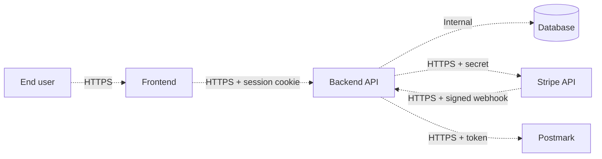

# Sample Threat Model — Subscription SaaS with Stripe

## Project name

Example Subscription SaaS (matches `examples/sample-stripe-architecture.md`).

## Document metadata

| Field | Value |
| --- | --- |
| Owner | Architect (Claude) |
| Status | Reviewed |
| Last updated | 2026-05-25 |
| Source architecture | `examples/sample-stripe-architecture.md` |

---

## 1. Scope

In scope:

- Authenticated user flow from signup through Stripe-hosted Checkout, Customer Portal, and dashboard gating.
- Stripe webhook receiver, signature verification, and idempotency handling.
- Local mirror of Customer / Subscription / WebhookEvent state.
- Postmark notification flow tied to subscription state changes.

Out of scope (for this threat model):

- Marketing site, blog, and unauthenticated routes that touch no billing data.
- Stripe Tax behavior — Stripe owns it.
- Card-data handling — Stripe Checkout owns the PCI scope.

---

## 2. Assets

| Asset | Description | Sensitivity | Owner |
| --- | --- | --- | --- |
| Stripe secret key (`STRIPE_SECRET_KEY`) | Authorizes all Stripe API calls | Secret | Operator |
| Stripe webhook secret (`STRIPE_WEBHOOK_SECRET`) | Verifies webhook authenticity | Secret | Operator |
| Authenticated user session | Identifies which user is acting | Personal | Auth provider + app |
| `Customer` table | Maps app user to Stripe customer id | Personal | App |
| `Subscription` table | Drives dashboard access | Personal | App |
| `WebhookEvent` table | Idempotency log; integrity affects state correctness | Internal | App |
| User email address | Used for Postmark notifications | Personal | App + Postmark |
| Stripe-side payment method, card data | PCI; never enters this system | Restricted (Stripe-owned) | Stripe |

---

## 3. Trust boundaries and data flow

| Boundary | Crosses | What flows | Trust change |
| --- | --- | --- | --- |
| B1 | User browser → Frontend | Auth credentials, click events | Untrusted → browser-trusted |
| B2 | Frontend → Backend API | Session cookie, checkout requests | Browser-trusted → server-trusted |
| B3 | Backend → Stripe | `STRIPE_SECRET_KEY`, customer + price ids | Server-trusted → Stripe-trusted |
| B4 | Stripe → Backend (webhook) | Signed event payload | Stripe-trusted → server-trusted (only after signature verification) |
| B5 | Backend → Database | SQL or driver-native queries | Server-trusted → DB-trusted |
| B6 | Backend → Postmark | Postmark token, recipient address, template | Server-trusted → Postmark-trusted |

---

## 4. STRIDE analysis

### Spoofing

| Threat | Affected component | Likelihood | Impact | Mitigation | Owner |
| --- | --- | ---: | ---: | --- | --- |
| Attacker forges a Stripe webhook to mark a subscription active without paying | Webhook endpoint (B4) | Medium | High | Verify `Stripe-Signature` against the raw body using `STRIPE_WEBHOOK_SECRET` before any parsing. Reject mismatches with 400. | Cursor |
| Attacker impersonates a user via stolen session cookie | Frontend → API (B2) | Low | High | Auth provider enforces HttpOnly, Secure, SameSite cookies. Short session lifetime. Refresh requires re-auth on sensitive actions. | Cursor |
| Attacker calls `/api/checkout-session` with another user's id in the body | Backend API (B2) | Medium | Medium | Backend uses the authenticated subject from the session for all Stripe customer mapping; the body is ignored. | Cursor |

### Tampering

| Threat | Affected component | Likelihood | Impact | Mitigation | Owner |
| --- | --- | ---: | ---: | --- | --- |
| Replay of a captured webhook to apply state changes twice | Webhook endpoint (B4) | Medium | High | `WebhookEvent` table with `stripe_event_id` as a unique constraint; handlers run only on first insert. | Cursor |
| Modification of in-flight HTTP requests | All HTTPS boundaries | Low | High | HSTS, TLS 1.2+ enforced. Stripe and Postmark already enforce TLS. | Operator |
| Database row tampering (insider) | DB (B5) | Low | High | Database access via managed identity only; no shared SQL users; audit logging on subscription tables. | Operator |

### Repudiation

| Threat | Affected component | Likelihood | Impact | Mitigation | Owner |
| --- | --- | ---: | ---: | --- | --- |
| User denies they cancelled / reactivated; we cannot prove the action | Customer Portal (Stripe-side) | Low | Medium | Stripe records every Portal action. Mirror `customer.subscription.updated` events into `WebhookEvent` with `received_at`. | Cursor |
| Operator changes subscription state in the DB without trace | DB | Low | Medium | Audit trail on `Subscription` table; manual DB writes require a documented incident ticket. | Operator |

### Information disclosure

| Threat | Affected component | Likelihood | Impact | Mitigation | Owner |
| --- | --- | ---: | ---: | --- | --- |
| Stripe secret key shipped in frontend bundle | Build pipeline (B1) | Medium | High | Secret is backend-only. CI grep step asserts no `sk_*` or `whsec_` in the built bundle. | Cursor + CI |
| Logs leak card-data-adjacent metadata or webhook payloads | Backend logs | Medium | Medium | `standards/observability-standards.md` forbids logging headers, full payloads, or PII beyond minimum. Logs include only `stripe_event_id`, `customer_id`, `subscription_id`. | Cursor |
| Cross-user data exposure via guessable ids | Backend API | Medium | High | Every query is scoped to the authenticated subject. Attempting to read another customer returns 404. | Cursor |
| Stripe webhook 5xx response includes stack trace | Webhook endpoint (B4) | Low | Medium | Response body is the recommended Stripe shape; no internal detail. | Cursor |

### Denial of service

| Threat | Affected component | Likelihood | Impact | Mitigation | Owner |
| --- | --- | ---: | ---: | --- | --- |
| Floods of `/api/checkout-session` calls exhaust quota | Backend API (B2) | Medium | Medium | Per-user rate limit; auth requirement removes most anonymous abuse. | Cursor |
| Webhook handler hangs on long Stripe API call | Webhook endpoint | Low | Medium | Respond 200 to Stripe after persisting `WebhookEvent`; do downstream work via queue or async path. | Cursor |
| Postmark outage blocks webhook 200 response | Postmark integration | Medium | Medium | Send email best-effort after DB write; do not couple Stripe's 200 to Postmark. | Cursor |

### Elevation of privilege

| Threat | Affected component | Likelihood | Impact | Mitigation | Owner |
| --- | --- | ---: | ---: | --- | --- |
| User on free tier sees premium dashboard | Dashboard gating | Medium | Medium | Gate server-side on `Subscription.status in ('active','trialing')` AND `current_period_end > now`. Client-only gating is treated as advisory. | Cursor |
| Cancelled user retains access between Portal cancel and webhook arrival | Dashboard gating | Medium | Medium | Gate also reads `cancel_at_period_end` and prefers the shorter remaining window. Backfill the dashboard state from Stripe API on dashboard load when within 60s of a known webhook delivery. | Cursor |
| Cursor introduces an unauthenticated admin endpoint by mistake | API surface | Low | High | Every new route documented in `API_SPEC.md` with `Auth required` column; Codex E2E tests check `401` on unauth attempts. | Cursor + Codex |

---

## 5. Accepted risks

| Risk | Why accepted | Re-review date |
| --- | --- | --- |
| Brief window where a cancelled user can refresh and still see the dashboard until the webhook arrives (typically < 5 seconds in production) | Eliminating it requires synchronous Stripe API call on every dashboard load; cost and latency outweigh the security benefit. | 2026-11-25 (six months) |
| Postmark outage produces user-invisible email loss during the outage window | Postmark publishes deliveries; we can replay manually. Building a queue + retry adds complexity disproportionate to v1's email importance. | 2026-11-25 |

---

## 6. Open questions

| Question | Owner | Needed by |
| --- | --- | --- |
| Do we need to support customer-initiated refunds in v1, and if so what is the threat model for refund abuse? | Product owner | Before refund feature is scoped |
| Should we add Stripe Radar rules and treat fraud signals as a separate input to entitlement decisions? | Architect + Product owner | Before live launch |

---

## 7. Sign-off

- [ ] Architect (Claude) has reviewed and endorsed.
- [ ] Quality engineer (Codex) has confirmed every High-impact threat has a matching test case in `examples/sample-stripe-test-plan.md`.
- [ ] Developer (Cursor) has confirmed the mitigations are implementable as written.
- [ ] Product owner has approved the accepted risks and re-review dates.
