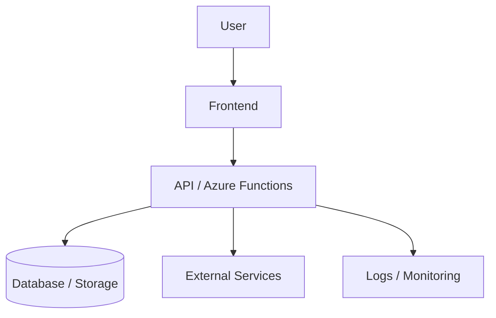
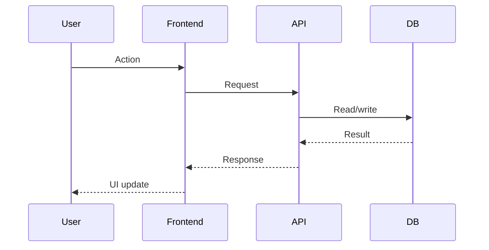

# Architecture

## Project name

`TODO`

## Status

Proposed | Approved | Superseded

---

## Executive summary

Summarize the architecture and why it fits the business goal.

---

## Requirements

### Functional requirements

- `TODO`

### Non-functional requirements

| Category | Requirement |
|---|---|
| Security | `TODO` |
| Performance | `TODO` |
| Reliability | `TODO` |
| Maintainability | `TODO` |
| Accessibility | `TODO` |
| Observability | `TODO` |
| Cost | `TODO` |

---

## Assumptions

- `TODO`

---

## Recommended architecture



---

## Components

| Component | Responsibility | Technology |
|---|---|---|
| Frontend | `TODO` | `TODO` |
| API | `TODO` | `TODO` |
| Database | `TODO` | `TODO` |
| Storage | `TODO` | `TODO` |
| Email | `TODO` | `TODO` |
| Payments | `TODO` | `TODO` |
| Monitoring | `TODO` | `TODO` |

---

## Data flow

Describe how data moves through the system.



---

## API design

| Method | Path | Purpose | Auth required |
|---|---|---|---|
| `GET` | `/api/example` | `TODO` | Yes/No |

### Standard success response

```json
{
  "ok": true,
  "data": {}
}
```

### Standard error response

```json
{
  "ok": false,
  "error": {
    "code": "ERROR_CODE",
    "message": "Safe user-facing message."
  }
}
```

---

## Data model

| Entity | Purpose | Key fields |
|---|---|---|
| `TODO` | `TODO` | `TODO` |

---

## Integrations

| Integration | Purpose | Auth/secret | Failure behavior |
|---|---|---|---|
| `TODO` | `TODO` | `TODO` | `TODO` |

---

## Security model

- Authentication: `TODO`
- Authorization: `TODO`
- Secret management: `TODO`
- Sensitive data: `TODO`
- Webhook verification: `TODO`
- Audit logging: `TODO`

---

## Environment and deployment plan

| Environment | Purpose | URL/resource |
|---|---|---|
| Local | Developer testing | `localhost` |
| Dev | Shared development | `TODO` |
| Staging | Release candidate testing | `TODO` |
| Production | Live system | `TODO` |

---

## Observability

- Logs: `TODO`
- Metrics: `TODO`
- Alerts: `TODO`
- Dashboards: `TODO`
- Correlation IDs: `TODO`

---

## Alternatives considered

| Option | Why not chosen |
|---|---|
| `TODO` | `TODO` |

---

## Trade-offs

| Decision | Benefit | Cost/risk |
|---|---|---|
| `TODO` | `TODO` | `TODO` |

---

## Risks and mitigations

| Risk | Likelihood | Impact | Mitigation |
|---|---:|---:|---|
| `TODO` | Low/Medium/High | Low/Medium/High | `TODO` |

---

## Work breakdown

1. `TODO`
2. `TODO`
3. `TODO`

---

## Cursor developer handoff

See `examples/sample-cursor-handoff.md` for the full format.

---

## Codex QE handoff

See `examples/sample-codex-qe-handoff.md` for the full format.
