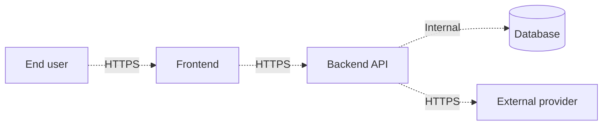

# Threat Model

## Project name

`TODO`

## Document metadata

| Field               | Value                       |
|---------------------|-----------------------------|
| Owner               | Architect                   |
| Status              | Draft / Reviewed / Approved |
| Last updated        | `TODO`                      |
| Source architecture | `TODO`                      |

---

## 1. Scope

What system or feature does this threat model cover? What is explicitly out of scope?

---

## 2. Assets

What is worth protecting? List every distinct asset and its sensitivity.

| Asset  | Description | Sensitivity                                                | Owner  |
|--------|-------------|------------------------------------------------------------|--------|
| `TODO` | `TODO`      | Public / Internal / Personal / Financial / Health / Secret | `TODO` |

---

## 3. Trust boundaries and data flow

Use a diagram (Mermaid is fine) to show major components, the boundaries between trust zones, and the data flowing across each boundary. Every boundary crossing is a place threats can apply.

List each boundary explicitly:

| Boundary | Crosses         | What flows | Trust change                |
|----------|-----------------|------------|-----------------------------|
| `TODO`   | User → Frontend | `TODO`     | Untrusted → Browser-trusted |

---

## 4. STRIDE analysis

For each component or boundary, walk through the six STRIDE categories. Skip categories that genuinely do not apply, but be honest — most categories apply more often than not.

### Spoofing — pretending to be someone you are not

| Threat | Affected component |       Likelihood |           Impact | Mitigation | Owner  |
|--------|--------------------|-----------------:|-----------------:|------------|--------|
| `TODO` | `TODO`             | Low / Med / High | Low / Med / High | `TODO`     | `TODO` |

### Tampering — modifying data or code without authorization

| Threat | Affected component |       Likelihood |           Impact | Mitigation | Owner  |
|--------|--------------------|-----------------:|-----------------:|------------|--------|
| `TODO` | `TODO`             | Low / Med / High | Low / Med / High | `TODO`     | `TODO` |

### Repudiation — denying that an action took place

| Threat | Affected component |       Likelihood |           Impact | Mitigation | Owner  |
|--------|--------------------|-----------------:|-----------------:|------------|--------|
| `TODO` | `TODO`             | Low / Med / High | Low / Med / High | `TODO`     | `TODO` |

### Information disclosure — leaking data that should be private

| Threat | Affected component |       Likelihood |           Impact | Mitigation | Owner  |
|--------|--------------------|-----------------:|-----------------:|------------|--------|
| `TODO` | `TODO`             | Low / Med / High | Low / Med / High | `TODO`     | `TODO` |

### Denial of service — making the system unavailable

| Threat | Affected component |       Likelihood |           Impact | Mitigation | Owner  |
|--------|--------------------|-----------------:|-----------------:|------------|--------|
| `TODO` | `TODO`             | Low / Med / High | Low / Med / High | `TODO`     | `TODO` |

### Elevation of privilege — performing actions you are not authorized to perform

| Threat | Affected component |       Likelihood |           Impact | Mitigation | Owner  |
|--------|--------------------|-----------------:|-----------------:|------------|--------|
| `TODO` | `TODO`             | Low / Med / High | Low / Med / High | `TODO`     | `TODO` |

---

## 5. Accepted risks

Risks that exist but the team has consciously accepted, with reasoning.

| Risk   | Why accepted | Re-review date |
|--------|--------------|----------------|
| `TODO` | `TODO`       | `TODO`         |

---

## 6. Open questions

| Question | Owner  | Needed by |
|----------|--------|-----------|
| `TODO`   | `TODO` | `TODO`    |

---

## 7. Sign-off

- [ ] Architect (Claude) has reviewed and endorsed.
- [ ] Quality engineer (Codex) has reviewed and confirmed coverage in the test plan.
- [ ] Developer (Cursor) has confirmed mitigations are implementable.
- [ ] Product owner / technical owner has approved accepted risks.
